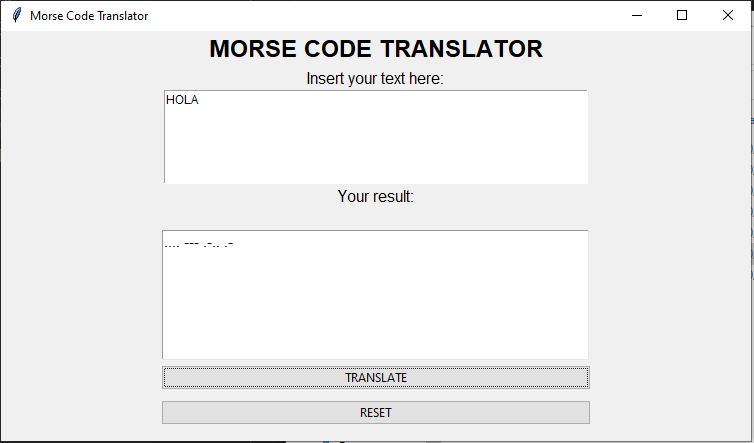

# :black_circle: :heavy_minus_sign: Morse Code Translator
## Info [:gb:]
### Description
Are you trying to send an s.o.s message in morse code?   
Don´t worry that little program tells you the correct dots and dashes for your message.   
Morse Code Translator converts words to morse code.

### language
Python

### status
**Allowed Characters:** alphanumeric, spaces and some signs (.,?/")

### installation
> - Download the morse.exe
> - Double click morse.exe
> - Enjoy

### Usage
> The user writes a word or sentence in the box, and then press the button.   
> The program will do all the work and show the result.

### Image

## Informacion [:es:]
### Descripción
¿Esta intentando mandar un mensaje s.o.s en código morse pero no sabe cómo?
No se preocupe, con este pequeño programa podrá hacerlo.
Morse Code Translator traduce tu mensaje a código morse.

### lenguaje
Python

### Estado
**Caracteres admitidos:** alfanuméricos, espacios y algunos sognos (.,?/")

### instalación
> - Descargue el ejecutable morse.exe desde este repositorio.
> - Haga doble click en morse.exe.
> - Disfrute.

### ¿Cómo usar?
> El usuario debe introducir unapalabrra u oración en el cuadro de texto.   
> El programa hará el resto.

### Imagen

